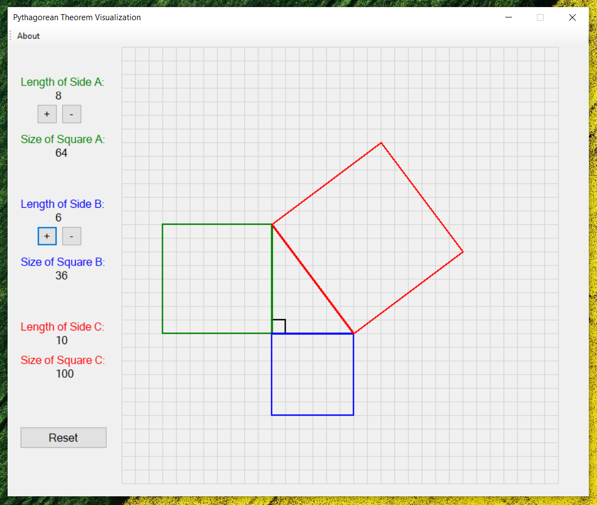

# .NET Pythagorean Theorem Visualization Tool
A simple tool created with .NET framework in C# used to visualize the Pythagorean Theorem.

## How is it used?
Play around with the "+" or "-" buttons to add or subtract from the "A" and "B" sides of the triangle. The 3rd side ("C") of the triangle as well as the subsequent squares of all sides will be drawn automatically as you do this. To add to that, the length of each side and the area of each square will be calculated on the side.

## How to run it
Inside Visual Studio, simply build the solution and run it. It should work unless your .NET framework is outdated (it's targeted for version 4.6.1). Also, there may be minor resolution problems for certain devices as of now.
