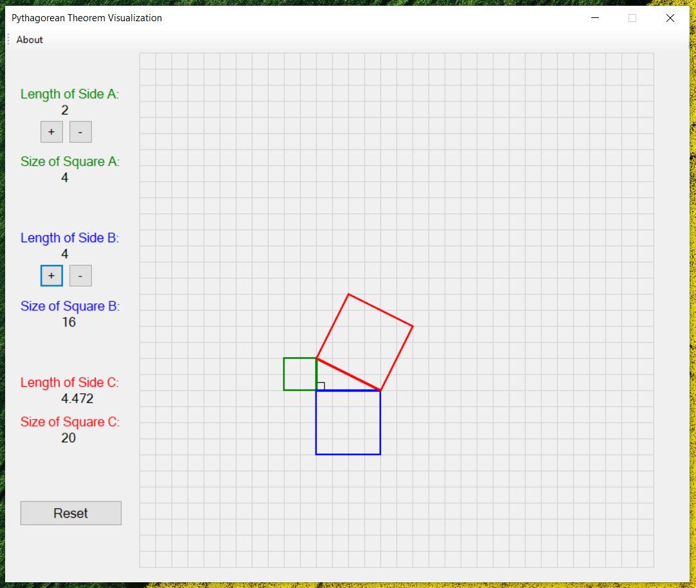

# .NET Pythagorean Theorem Visualization Tool
A simple Windows desktop application created with .NET in C# used to visualize the Pythagorean Theorem.

## How is it used?
Play around with the "+" or "-" buttons to add or subtract from the "A" and "B" sides of the triangle. The 3rd side ("C") of the triangle as well as the subsequent squares of all sides will be drawn automatically as you do this. To add to that, the length of each side and the area of each square will be calculated on the side.

## How to run it
Download the app [here](https://install.appcenter.ms/users/pd96/apps/pythagorean-theorem-visualization-tool/distribution_groups/all-users-of-pythagorean-theorem-visualization-tool)!

